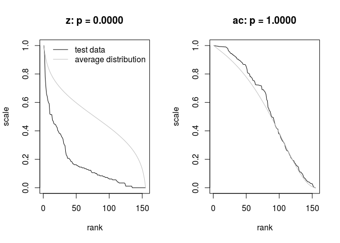
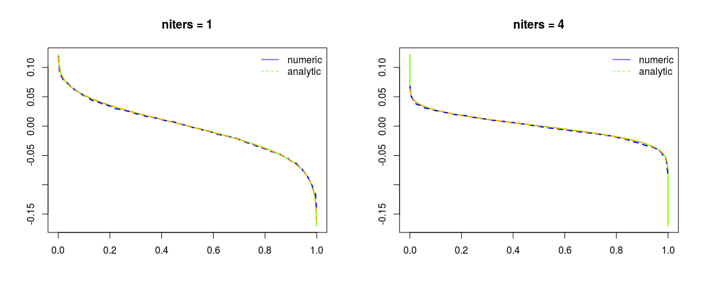

[](https://travis-ci.org/mpadge/hotspotr) [](https://codecov.io/gh/mpadge/hotspotr)

hotspotr
========

There are a number of statistical tools for evaluating the significance of observed spatial patterns of hotspots (such as those in [`spdep`](https://cran.r-project.org/package=spdep)). While such tools enable hotspots to be identified within a given set of spatial data, they do not allow quantification of whether the entire data set in fact reflects significant spatial structuring. For example, numbers of locally significant hotspots must be expected to increase with numbers of spatial observations.

The `R` package `hotspotr` enables the global significance of an observed spatial data set to be quantified by comparing both raw values and their local spatial relationships with those generated from a neutral model. If the global pattern of observed values is able to be reproduced by a neutral model, then any local hotspots may not be presumed significant regardless of the values of local statistics. Conversely, if the global pattern is unable to be reproduced by a neutral model, then local hotspots may indeed be presumed to be statistically significant.

The package is inspired by the work of *Brown, Mehlman, & Stevens* (Ecology 1995) and *Ives & Klopfer* (Ecology 1997). `hotspotr` follows the same premises as these two papers, in examining the extent to which rank--scale distributions can be reproduced by simple neutral models. `hotspotr` compares rank--scale distributions not only of the data of interest, but of corresponding local autocorrelation statistics.

Analysis involves first fitting a model using the function `fit_hotspot_model`, and then testing the significance of that using the function `p-values`.

------------------------------------------------------------------------

Contents
========

[1. Neutral hotspots](#1-neutral)

[2 Testing hotspot data](#2-hotspot-test)

[3 Parallel computation](#3-parallel)

[4. Analytic Distributions](#4-analytic-dists)

------------------------------------------------------------------------

Install
-------

``` r
devtools::install_github ('mpadge/hotspotr')
```

------------------------------------------------------------------------

<a name="1-neutral"></a>1. Neutral hotspots
===========================================

`hotspotr` works by simulating the statistical properties of a neutral model for hotspot generation (with the model largely following Brown et al (*Ecology* 1995)). This model is applied to a specified set of spatial points and neighbour lists, as illustrated with the following lines.

``` r
size <- 10
xy <- cbind (rep (seq (size), each=size), rep (seq (size), size))
dhi <- 1 # for rook; dhi=1.5 for queen
nbs <- spdep::dnearneigh (xy, 0, dhi)
```

The function `neutral_hotspots` then generates a neutral model determined by the three parameters:

1.  sd0 = Standard deviation of the environmental variables;

2.  alpha = Strength of spatial autocorrelation (with negative values acceptable); and

3.  niters = Number of iterations of spatial autocorrelation simulated in model.

This function returns two vectors of simulated values:

``` r
dat <- neutral_hotspots (nbs, alpha=0.1, sd=0.1, niters=1, ntests=1000)
dim (dat); head (dat)
```

    ## [1] 100   2

    ##              z        ac
    ## [1,] 1.0000000 1.0000000
    ## [2,] 0.9420995 0.9736605
    ## [3,] 0.9080397 0.9476223
    ## [4,] 0.8831032 0.9238530
    ## [5,] 0.8646860 0.9021098
    ## [6,] 0.8479037 0.8801219

The two columns are simulated raw values and autocorrelation statistics, both sorted in decreasing order and scaled between 0 and 1, and so both providing respective rank-scale distribution to be compared with observed rank-scale distributions.

------------------------------------------------------------------------

<a name="2-hotspot-test"></a>2 Testing hotspot data
---------------------------------------------------

The statistical significance of an observed vector of hotspot data and corresponding list of neighbours (and optional neighbour weights) may be tested by first fitting a hotspot model to desired test data. This is illustrated here with topsoil heavy metal concentrations from the `sp` package:

``` r
data (meuse, package='sp') 
names (meuse); dim (meuse)
```

    ##  [1] "x"       "y"       "cadmium" "copper"  "lead"    "zinc"    "elev"   
    ##  [8] "dist"    "om"      "ffreq"   "soil"    "lime"    "landuse" "dist.m"

    ## [1] 155  14

``` r
z <- meuse ['cadmium'][,1] # a vector of 155 spatial values
```

Construct neighbour weights by inverse distances:

``` r
xy <- cbind (meuse$x, meuse$y)
nbs <- spdep::knn2nb (spdep::knearneigh (xy, k=4))
dists <- spdep::nbdists (nbs, xy)
d1 <- lapply (dists, function (i) 1/i)
wts <- lapply (d1, function (i) i / sum (i))
```

Fit a neutral model of hotspot generation:

``` r
mod <- fit_hotspot_model (z, nbs=nbs, wts=wts, ntests=1000)
mod
```

    ## $sd0
    ## [1] 0.000001
    ## 
    ## $ac
    ## [1] 0.3576799
    ## 
    ## $niters
    ## [1] 4

And test the probability of such a model being randomly generated:

``` r
p_values (z=z, nbs=nbs, sd0=mod$sd0, alpha=mod$ac, niters=mod$niters,
          ntests=1e4, plot=TRUE)
```



``` r
## $p_z
## [1] 0
## 
## $p_ac
## [1] 0.9999425
```

Revealing that the raw statistics are unable to be generated by a neutral model, yet the spatial autocorrelation statistics do not differ significantly from those of a neutral model. This indicates that the generating processes can be modelled by assuming nothing other than simple spatial autocorrelation acting on a more complex, non-spatial process.

------------------------------------------------------------------------

<a name="3-parallel"></a>3 Parallel computation
-----------------------------------------------

`neutral_hotspots` also has a `parallel` option that determines whether the tests are conducting using an `Rcpp` (non-parallel) loop, or using `R:parellel`. The latter may be faster under some circumstances for large numbers of tests, although it will definitely be slower for smaller numbers because of the time needed to establish the parallel clusters. Differences are illustrated here:

``` r
ntests <- 1000
set.seed (1)
st1 <- system.time (dat1 <- neutral_hotspots (nbs, ntests=ntests))
set.seed (1)
st2 <- system.time (dat2 <- neutral_hotspots (nbs, ntests=ntests,
                                              parallel=TRUE))
st1; st2
```

    ##    user  system elapsed 
    ##   0.236   0.000   0.239

    ##    user  system elapsed 
    ##   0.096   0.004   3.183

------------------------------------------------------------------------

<a name="4-analytic-dists"></a>4. Analytic Distributions
--------------------------------------------------------

Analytic rank-scale distributions can be obtained from the order statistic for a normal distribution of `n` samples. The following function demonstrates that the effect of adding multiple truncated normal distributions can be quantified simply by changing the standard deviation of a single (non-iterated) probability density function.

``` r
plotdists <- function (sd=0.1, n=1e4, logx=TRUE, niters=1, p0)
{
    if (length (sd) == 1)
        sd <- rep (sd, 2)

    # --------   numerically simulated distribution
    xn <- rep (0, n)
    for (i in 1:niters)
        xn <- xn + truncnorm::rtruncnorm (n=n, a=0, b=2, mean=1, sd=sd [1])
    xn <- xn / niters
    if (logx) xn <- log10 (xn)
    x1 <- sort (xn, decreasing=TRUE)

    # --------   analytic distribution
    x <- seq (2, 0, length.out=n)
    xd <- truncnorm::dtruncnorm (x, a=0, b=2, mean=1, sd=sd [2])
    xd <- cumsum (xd / sum (xd))

    if (missing (p0))
        p0 <- max (0, order_one (n, sd))

    indx <- which (x >= p0 & x <= (2 - p0))
    x <- x [indx]
    xd <- xd [indx]

    if (logx) x <- log10 (x) 

    plot (xd, x, "l", col="lawngreen", lwd=2, xlab="", ylab="")
    lines (seq (n) / n, x1, col="blue", lwd=2, lty=2)
    legend ("topright", lwd=1, lty=c(1, 2), col=c("blue", "lawngreen"), bty="n",
            legend=c("numeric", "analytic"))

    # Then interpolate x onto regular xd to return matching rank-scale dist
    xout <- approx (x=xd, y=x, xout=seq (0, 1, length.out=n))
    lines (xout$x, xout$y, col="orange", lwd=2, lty=2)
    return (xout$y)
}
```

The left panel demonstrates that distributions are equal in the non-iterated case (`niters=1`), while the right demonstrate the equivalence of multiple iterations to reductions in standard deviation. (The numerical values are only approximate due to the low numbers of samples; higher values of *n* ⪆ 10<sup>4</sup> yield visually better alignment.) Note that the second standard deviation of `0.05` is only a guess.

``` r
par (mfrow=c(1,2))
n <- 100
sd <- 0.1
p0 <- order_one (n, sd)
junk <- plotdists (sd=sd, n=n, p0=p0, niters=1)
title (main="niters = 1")
junk <- plotdists (sd=c (sd, 0.05), n=n, p0=p0, niters=4)
title (main="niters = 4")
```



Hotspot models can thus be fitted using analytic probability densities which depend on the single parameter of standard deviation. No re-scaling is necessary, as a measure of fit can be obtained directly from the sum of squared residuals of a linear regression between the observed values and those returned from `plotdists`.
