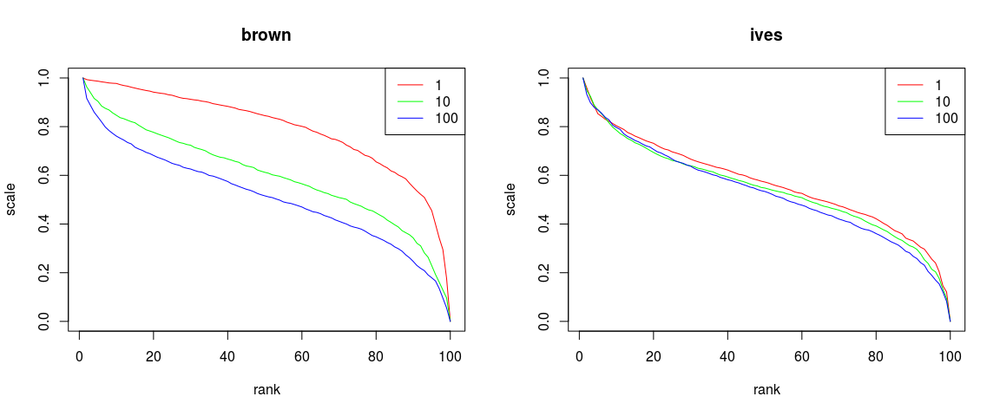
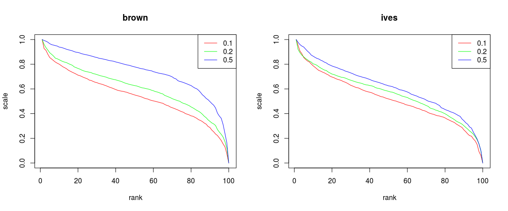
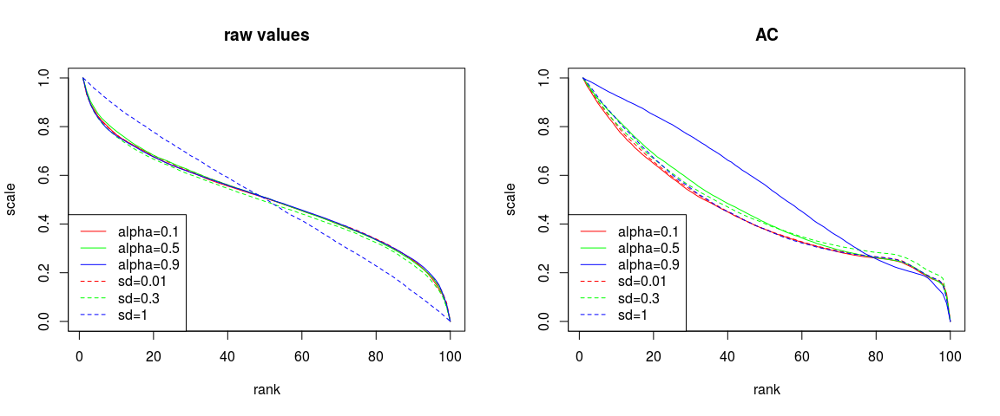
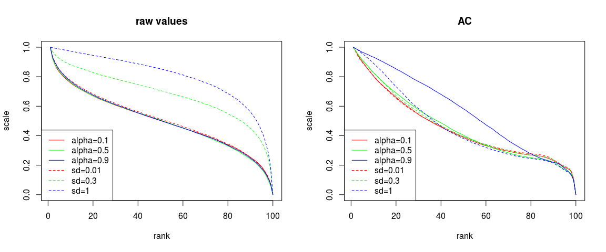
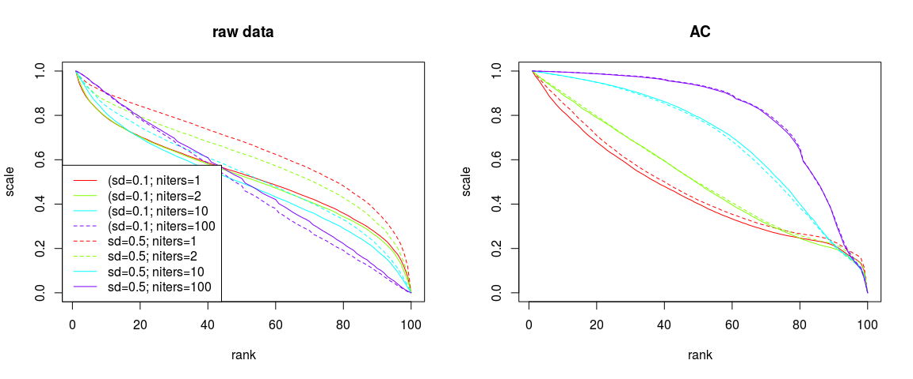
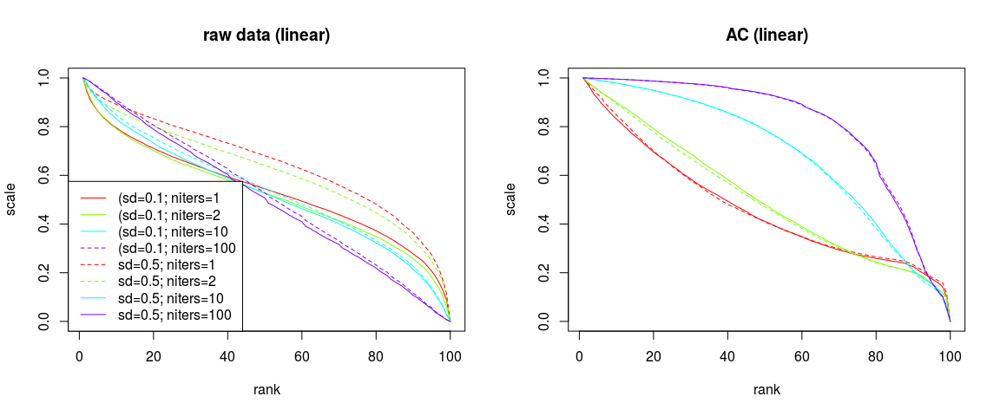

<a name="1-brown-ives"></a>1. Brown vs Ives
===========================================

[1. Install](#1-install)

[2. Function Definitions](#2-functions)

[3. Comparison of the Two Models](#3-comparisons)

[3.1. Number of Iterative Layers](#3.1-nlayers)

[3.2. Standard Devitation](#3.2-sd)

[4. Equivalence of SD and Number of Layers](#4-sd-equals-nlayers)

[5. A Spatial Version of *Brown et al* (1995)](#5-brown-spatial)

[5.1 Constructing Lists of Neighbours](#5.1-neighbours)

[5.2 Function Definition](#5.2-function)

[5.3 Comparison of *α* and SD](#5.3-plots1)

[5.4 Comparison of *α* and SD (log scale)](#5.4-plots2)

[5.5 Comparison of numbers of AC iterations](#5.5-plots3)

<a name="1-install"></a>1. Install
----------------------------------

``` r
while (length (grep ('hotspotr', getwd ())) > 0) setwd ("..")
devtools::load_all ("hotspotr")
setwd ("./hotspotr")
```

------------------------------------------------------------------------

<a name="2-functions"></a>2. Function Definitions
-------------------------------------------------

The functions are first defined here with explicit and successive layers of autocorrelation. The respective models of Brown and Ives are:

``` r
brown_core <- function (ntests=10, nlayers=10, size=10, sd0=0.1)
{
    y <- lapply (seq (ntests), function (i)
                 {
                     z <- rep (1, size ^ 2)
                     for (j in seq (nlayers)) 
                         z <- z * msm::rtnorm (size ^ 2, mean=1, sd=sd0, 
                                               lower=0, upper=2)
                     z <- sort (log10 (z), decreasing=TRUE)
                     (z - min (z)) / diff (range (z))
                 })
    colMeans (do.call (rbind, y))
}

ives_core <- function (ntests=10, nlayers=10, size=10, sd0=0.1)
{
    # The following 3 parameters are fixed by Ives et al
    a0 <- 0.05 
    s0 <- 0.5
    r0 <- 1.05

    y <- lapply (seq (ntests), function (i)
                 {
                     z <- rep (1, size ^ 2)
                     for (j in seq (nlayers))
                     {
                        svec <- msm::rtnorm (size ^ 2, mean=s0, sd=sd0, 
                                             lower=0, upper=2 * s0)
                        rvec <- msm::rtnorm (size ^ 2, mean=r0, sd=sd0, 
                                             lower=0, upper=2 * r0)
                        z <- svec * z + (1 + rvec / (1 + a0 * z))
                     }
                     z <- sort (log10 (z), decreasing=TRUE)
                     (z - min (z)) / diff (range (z))
                 })
    colMeans (do.call (rbind, y))
}
```

Then define a re-usable function to plot the results

``` r
ploty <- function (nt, y)
{
    plot (NULL, NULL, xlim=c (1, size^2), ylim=c(0,1), xlab="rank", ylab="scale")
    cols <- rainbow (length (nt))
    y <- lapply (seq (length (y)), function (i) 
                     lines (seq (size^2), y [[i]], col=cols [i]))
    legend ("topright", lwd=1, col=cols, legend=nt)
}
```

------------------------------------------------------------------------

<a name="3-comparisons"></a>3. Comparison of the Two Models
-----------------------------------------------------------

### <a name="3.1-nlayers"></a>3.1 Effect of Number of Iterative Layers

First compare them in terms of numbers of successive layers of autocorrelation:

``` r
size <- 10
nlayers <- c (1, 10, 100)
ntests <- 10
yb <- lapply (nlayers, function (i) 
              brown_core (nlayers=i, ntests=ntests, size=size, sd0=1))
yi <- lapply (nlayers, function (i) 
              ives_core (nlayers=i, ntests=ntests, size=size))

plot.new ()
par (mfrow=c(1,2))
ploty (nlayers, yb)
title (main=paste ("brown"))

ploty (nlayers, yi)
title (main=paste ("ives"))
```



And the difference is clearly that Brown is able to respond to differences in numbers of layers, while Ives remains entirely invariant. In other words, the model of *Ives et al* (1997) may *not* be used as a neutral model because it is does not respond to structural differences!

------------------------------------------------------------------------

### <a name="3.2-sd"></a>3.2 Effect of Standard Deviation of Environmental Variables

The only other variable in both cases is `sd0`

``` r
size <- 10
nlayers <- 1
sd0 <- c (0.1, 0.2, 0.5)
ntests <- 10
yb <- lapply (sd0, function (i) 
              brown_core (nlayers=nlayers, ntests=ntests, size=size, sd0=i))
yi <- lapply (sd0, function (i) 
              ives_core (nlayers=nlayers, ntests=ntests, size=size, sd0=i))

plot.new ()
par (mfrow=c(1,2))
ploty (sd0, yb)
title (main=paste ("brown"))

ploty (sd0, yi)
title (main=paste ("ives"))
```



And again, Ives does respond, but only marginally compared to Brown.

------------------------------------------------------------------------

<a name="4-sd-equals-nlayers"></a>4. Equivalence of Standard Deviation and Number of Layers
-------------------------------------------------------------------------------------------

Moreover, since the product of two normal distributions is also a normal distribution, changes in `nlayers` within the model of *Brown et al* (1995) are the same as changes in the distributional variance, and so only one of these parameters needs to be considered. This is compared in the following graph, which also includes a Poisson distribution for comparison.

``` r
size <- 10
ntests <- 100
nlayers <- c (1, 10, 100)
sd0 <- c (0.001, 0.3, 1)
ylayers <- lapply (nlayers, function (i) 
              brown_core (nlayers=i, ntests=ntests, size=size, sd0=0.1))
ysd <- lapply (sd0, function (i) 
              brown_core (nlayers=1, ntests=ntests, size=size, sd0=i))

plot (NULL, NULL, xlim=c (1, size^2), ylim=c(0,1), xlab="rank", ylab="scale")
cols <- rainbow (3)
y <- lapply (seq (length (ylayers)), function (i) 
             {
                 lines (seq (size^2), ylayers [[i]], col=cols [i])
                 lines (seq (size^2), ysd [[i]], col=cols [i], lty=2)
             })

# Poisson distribution 
yp <- dpois (seq (size^2), 1, log=TRUE)
yp <- log10 (1 + yp - min (yp)) # convert to values > 0
yp <- (yp - min (yp)) / diff (range (yp))
lines (seq (size^2), yp)

ltxt <- sapply (nlayers, function (i) paste0 ('nlayers=', i))
ltxt <- c (ltxt, sapply (sd0, function (i) paste0 ('nsd=', i)), "Poisson")
legend ("bottomleft", lwd=1, col=c (rep (cols, 2), "black"), 
        lty=c (1,1,1,2,2,2,1), legend=ltxt)
```


It's obviously far more computationally efficient to consider variance rather than `nlayers`, and this also seems to allow a greater range of possible forms of response. Moreover, the response with increasing variance clearly approaches a Poisson distribution.

Note that although increasing the variance always decreases the relative probability of hotspots (that is, increases the width of the peak for low ranks), increasing the number of layers always decreases it. The graph nevertheless reveals that the response for a very large number of layers (here, 100) is accurately approximated by a very low variance (here, `sd=0.001`).

------------------------------------------------------------------------

<a name="5-brown-spatial"></a>5. A Spatial Version of Brown et al (1995)
========================================================================

There is no 'model' to speak of in *Brown et al* (1995), rather they merely examine the rank-scale properties of normal distributions. Spatial relationships may nevertheless modify such generic normal distributions, as now demonstrated.

First define a function to generate spatial autocorrelation on a grid, this time including autocorrelation statistics as well. An additional option controls whether values should be log-scaled or not.

<a name="5.1-neighbours"></a>5.1 Constructing Lists of Neighbours
=================================================================

Spatial autocorrelation has to be implemented by looping over the lists of neighbours. First define the neighbourhood lists for a rectangular grid of a given size.

``` r
size <- 10
xy <- cbind (rep (seq (size), each=size), rep (seq (size), size))
dhi <- 1 # for rook; dhi=1.5 for queen
nbs <- spdep::dnearneigh (xy, 0, dhi)
```

The actual lists of neighbours (although not required anywhere in the code) can be obtained simply as:

``` r
indx_nbs_to <- unlist (lapply (seq (nbs), function (i) 
                               rep (i, length (nbs [[i]]))))
indx_nbs_from <- unlist (nbs)
lens <- unlist (lapply (nbs, function (i) rep (length (i), length (i))))
head(indx_nbs_to, 10); head(indx_nbs_from, 10); head(lens, 10);
```

    ##  [1] 1 1 2 2 2 3 3 3 4 4

    ##  [1]  2 11  1  3 12  2  4 13  3  5

    ##  [1] 2 2 3 3 3 3 3 3 3 3

Then define a function to extract the iterative lists of neighbours (the lengths of each list are also needed):

``` r
maxnbs <- max (sapply (nbs, length))
get_nbsi <- function (i)
{
    res <- lapply (seq (nbs), function (j)
                   {
                       if (length (nbs [[j]]) >= i)
                           c (j, nbs [[j]] [i], length (nbs [[j]]))
                       else
                           NULL
                   })
    res <- res [lapply (res, length) != 0]
    res <- do.call (rbind, res)
    data.frame (to=res [,1], from=res [,2], n=res [,3])
}
```

Then the actual loop to implement the spatial autocorrelation is:

``` r
alpha <- 0.5
sd0 <- 0.1
z1 <- msm::rtnorm (size ^ 2, mean=1, sd=sd0, lower=0, upper=2)
maxnbs <- max (sapply (nbs, length))
z2 <- rep (0, length (z1))
for (i in seq (maxnbs))
{
    nbsi <- get_nbsi (i)
    z2 [nbsi$to] <- z2 [nbsi$to] + ((1 - alpha) * z1 [nbsi$to] +
        alpha * z1 [nbsi$from]) / nbsi$n
}
```

This can be confirmed by manually checking the values

``` r
z2 [1]; (1-alpha) * z1 [1] + alpha * (z1 [2] + z1 [11]) / 2
```

    ## [1] 1.031836

    ## [1] 1.031836

``` r
z2 [2]; (1-alpha) * z1 [2] + alpha * (z1 [1] + z1 [3] + z1 [12]) / 3
```

    ## [1] 1.100946

    ## [1] 1.100946

``` r
z2 [15]; (1-alpha) * z1 [15] + alpha * (z1 [5] + z1 [14] + z1 [16] + z1 [25]) / 4
```

    ## [1] 1.048706

    ## [1] 1.048706

------------------------------------------------------------------------

<a name="5.2-function"></a>5.2 Function Definition
==================================================

The final function definition

``` r
brown_space <- function (nbs, sd0=0.5, alpha=0.1, ntests=100, 
                         niters=1, log_scale=FALSE)
{
    wts <- lapply (nbs, function (x) rep (1, length (x)) / length (x))
    size <- length (nbs)

    ac_type <- 'moran'

    get_nbsi <- function (i)
    {
        res <- lapply (seq (nbs), function (j)
                       {
                           if (length (nbs [[j]]) >= i)
                               c (j, nbs [[j]] [i], length (nbs [[j]]))
                           else
                               NULL
                       })
        res <- res [lapply (res, length) != 0]
        res <- do.call (rbind, res)
        # Only converted to a df here, not in working version
        data.frame (to=res [,1], from=res [,2], n=res [,3])
    }
    maxnbs <- max (sapply (nbs, length))

    z <- lapply (seq (ntests), function (i) 
                 {
                     z1 <- rcpp_trunc_ndist (size, sd0); 
                     for (j in seq (niters))
                     {
                         z2 <- rep (0, size)
                         for (k in seq (maxnbs))
                         {
                             nbsi <- get_nbsi (k)
                             z2 [nbsi$to] <- z2 [nbsi$to] + 
                                 ((1 - alpha) * z1 [nbsi$to] +
                                  alpha * z1 [nbsi$from]) / nbsi$n
                         }
                         z1 <- z2
                     }
                     if (log_scale) z1 <- log10 (z1)
                     ac1 <- rcpp_ac_stats (z1, nbs, wts, ac_type)
                     z1 <- sort (z1, decreasing=TRUE)
                     z1 <- (z1 - min (z1)) / diff (range (z1))
                     cbind (z1, ac1)
                 })

    ac1 <- colMeans (do.call (rbind, lapply (z, function (i) i [,2])))
    z <- colMeans (do.call (rbind, lapply (z, function (i) i [,1])))
    cbind (z, ac1)
}
```

------------------------------------------------------------------------

<a name="5.3-plots1"></a>5.3 Comparison of *α* and SD
=====================================================

Then compare different values of `alpha` and of `sd`. The two methods of calculation are explicitly incorporated here - the first being the above, purely `R` version, and the second the entirely `Rcpp` version. (From hereon, only the second, much faster version will be kept.)

``` r
log_scale <- FALSE
sd0 <- c (0.00001, 0.3, 1)
sd0 <- c (0.01, 0.3, 1)
size <- 10
ysd <- lapply (sd0, function (i) 
               brown_space (sd0=i, alpha=0, size=size, log_scale=log_scale))
alpha <- c (0.1, 0.5, 0.9)
yalpha <- lapply (alpha, function (i) 
               brown_space (sd0=sd0 [1], alpha=i, size=size, log_scale=log_scale))
```

``` r
log_scale <- FALSE
sd0 <- c (0.01, 0.3, 1)
size <- 10
ysd <- lapply (sd0, function (i)
               neutral_hotspots_ntests2 (nbs, alpha=0, sd=i, log_scale=log_scale))
alpha <- c (0.1, 0.5, 0.9)
yalpha <- lapply (alpha, function (i)
                  neutral_hotspots_ntests2 (nbs, alpha=i, sd=sd0 [1], 
                                            log_scale=log_scale))
```

``` r
doplots <- function ()
{
    mts <- c ("raw values", "AC")
    cols <- rainbow (length (sd0))
    ltxt <- sapply (alpha, function (i) paste0 ('alpha=', i))
    ltxt <- c (ltxt, sapply (sd0, function (i) paste0 ('sd=', i)))
    for (i in 1:2)
    {
        plot (NULL, NULL, xlim=c (1, size^2), ylim=c(0,1), xlab="rank", ylab="scale")
        title (main=mts [i])
        for (j in 1:length (sd0)) 
        {
            lines (seq (size^2), yalpha [[j]] [,i], col=cols [j])
            lines (seq (size^2), ysd [[j]] [,i], col=cols [j], lty=2)
        }
        legend ("bottomleft", lwd=1, col=rep (cols, 2), lty=c (1,1,1,2,2,2),
                legend=ltxt)
    }
}
```

``` r
plot.new ()
par (mfrow=c(1,2))
doplots ()
```



------------------------------------------------------------------------

<a name="5.4-plots2"></a>5.4 Comparison of *α* and SD (log scale)
=================================================================

Then repeat for log-scaled values

``` r
log_scale <- TRUE
sd0 <- c (0.00001, 0.3, 1)
sd0 <- c (0.01, 0.3, 1)
size <- 10
ysd <- lapply (sd0, function (i) 
               brown_space (sd0=i, alpha=0, size=size, log_scale=log_scale))
alpha <- c (0.1, 0.5, 0.9)
yalpha <- lapply (alpha, function (i) 
               brown_space (sd0=sd0 [1], alpha=i, size=size, log_scale=log_scale))
ysd <- lapply (sd0, function (i)
               neutral_hotspots_ntests2 (nbs, alpha=0, sd=i, log_scale=log_scale))
```

``` r
log_scale <- TRUE
sd0 <- c (0.00001, 0.3, 1)
sd0 <- c (0.01, 0.3, 1)
size <- 10
ysd <- lapply (sd0, function (i)
               neutral_hotspots_ntests2 (nbs, alpha=0, sd=i, log_scale=log_scale))
alpha <- c (0.1, 0.5, 0.9)
yalpha <- lapply (alpha, function (i)
                  neutral_hotspots_ntests2 (nbs, alpha=i, sd=sd0 [1], 
                                            log_scale=log_scale))
```

``` r
plot.new ()
par (mfrow=c(1,2))
doplots ()
```



------------------------------------------------------------------------

<a name="5.5-plots3"></a>5.5 Comparison of numbers of AC iterations
===================================================================

And then examine the effect of multiple iterations of spatial autocorrelation

``` r
niters <- c (1, 2, 10, 100)
log_scale <- TRUE
sd0 <- 0.5
alpha <- 0.5
#y1 <- lapply (niters, function (i) 
#               brown_space (sd0=0.1, alpha=0.5, size=size, niters=i,
#                            log_scale=log_scale))
#y2 <- lapply (niters, function (i) 
#               brown_space (sd0=0.9, alpha=0.5, size=size, niters=i,
#                            log_scale=log_scale))
y1 <- lapply (niters, function (i)
              neutral_hotspots_ntests2 (nbs, alpha=0.5, sd=0.1, niters=i,
                                        log_scale=log_scale))
y2 <- lapply (niters, function (i)
              neutral_hotspots_ntests2 (nbs, alpha=0.5, sd=0.9, niters=i,
                                        log_scale=log_scale))
```

``` r
mts <- c ("sd0=0.1", "sd0=0.5")
cols <- rainbow (length (niters))
ltxt <- sapply (niters, function (i) paste0 ('(sd=0.1; niters=', i))
ltxt <- c (ltxt, sapply (niters, function (i) paste0 ('sd=0.5; niters=', i)))
plot.new ()
par (mfrow=c(1,2))
plot (NULL, NULL, xlim=c (1, size^2), ylim=c(0,1), xlab="rank", ylab="scale",
      main="raw data")
for (j in 1:length (niters)) 
{
    lines (seq (size^2), y1 [[j]] [,1], col=cols [j])
    lines (seq (size^2), y2 [[j]] [,1], col=cols [j], lty=2)
}
legend ("bottomleft", lwd=1, col=rep (cols, 2), lty=c (1,1,1,2,2,2),
        legend=ltxt)

plot (NULL, NULL, xlim=c (1, size^2), ylim=c(0,1), xlab="rank", ylab="scale",
      main="AC")
for (j in 1:length (niters)) 
{
    lines (seq (size^2), y1 [[j]] [,2], col=cols [j])
    lines (seq (size^2), y2 [[j]] [,2], col=cols [j], lty=2)
}
```



These functions are highly responsive, in particular to numbers of iterations, and in particular in terms of autocorrelation statistics. Note that these results were all generated using log-scaled values, while the linearly scaled equivalents look like this:

``` r
y1l <- lapply (niters, function (i) 
               brown_space (sd0=0.1, alpha=0.5, size=size, niters=i,
                            log_scale=FALSE))
y2l <- lapply (niters, function (i) 
               brown_space (sd0=0.9, alpha=0.5, size=size, niters=i,
                            log_scale=FALSE))
```

``` r
y1l <- lapply (niters, function (i)
               neutral_hotspots_ntests2 (nbs, alpha=0.5, sd=0.1, niters=i,
                                         log_scale=log_scale))
y2l <- lapply (niters, function (i)
              neutral_hotspots_ntests2 (nbs, alpha=0.5, sd=0.9, niters=i,
                                        log_scale=log_scale))
```

``` r
mts <- c ("sd0=0.1", "sd0=0.5")
cols <- rainbow (length (niters))
ltxt <- sapply (niters, function (i) paste0 ('(sd=0.1; niters=', i))
ltxt <- c (ltxt, sapply (niters, function (i) paste0 ('sd=0.5; niters=', i)))
plot.new ()
par (mfrow=c(1,2))
plot (NULL, NULL, xlim=c (1, size^2), ylim=c(0,1), xlab="rank", ylab="scale",
      main="raw data (linear)")
for (j in 1:length (niters)) 
{
    lines (seq (size^2), y1l [[j]] [,1], col=cols [j])
    lines (seq (size^2), y2l [[j]] [,1], col=cols [j], lty=2)
}
legend ("bottomleft", lwd=1, col=rep (cols, 2), lty=c (1,1,1,2,2,2),
        legend=ltxt)

plot (NULL, NULL, xlim=c (1, size^2), ylim=c(0,1), xlab="rank", ylab="scale",
      main="AC (linear)")
for (j in 1:length (niters)) 
{
    lines (seq (size^2), y1l [[j]] [,2], col=cols [j])
    lines (seq (size^2), y2l [[j]] [,2], col=cols [j], lty=2)
}
```



And log-scaling has pronounced effects only on the structure of the raw values, while the autocorrelation statistics remain largely unaffected.
